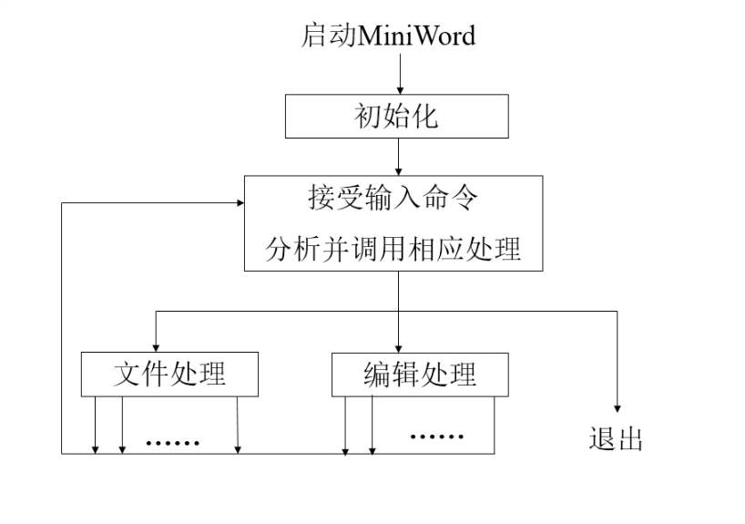
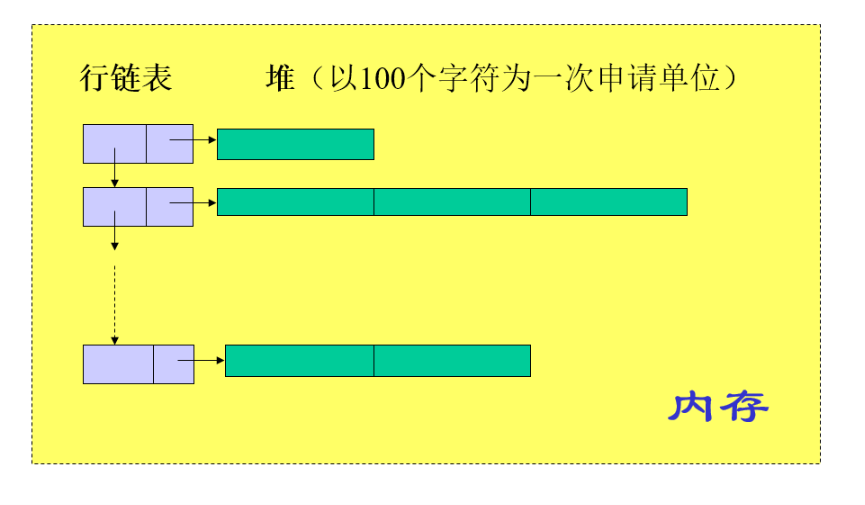
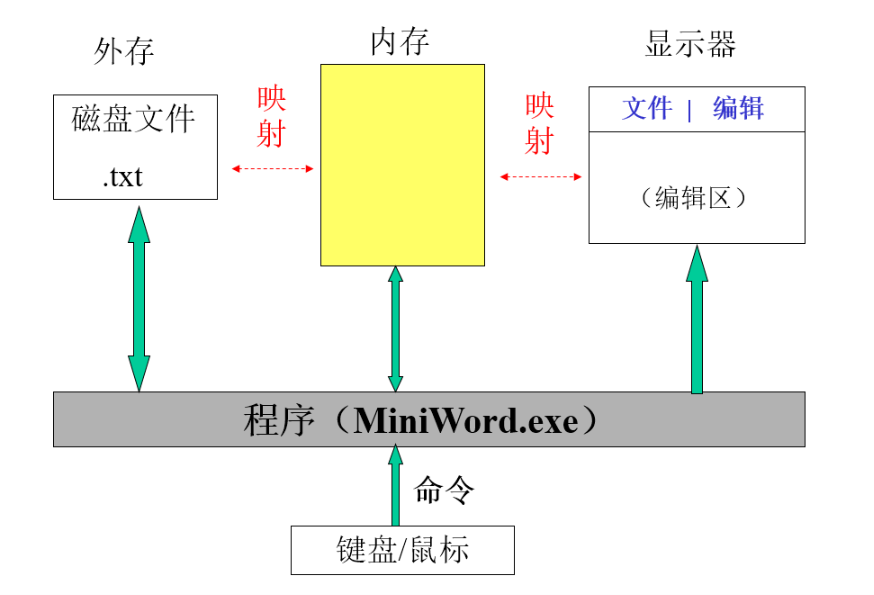

# 任务描述

## 问题描述

* 基本要求：MiniWord可分为两个操作状态
  * 文件状态：可以对文件进行打开、写盘等操作。
  * 编辑状态：可以对正文文件进行输入、修改、查找、替换等操作。（在输入或者修改的时候，光标至少可以使用键盘定位）

### 功能需求

* 新文件处理功能

  * 新建文件：若编辑区有未保存的编辑内容，先询问是否保存然后再清空编辑区。
  * 打开文件：要求用户输入文件名，该文件存在则打开并载入编辑区，否则提示未新文件。
  * 保存文件：提示用户当前文件名，用户可以重置文件名，确认后将当前编辑的文件写入磁盘。
  * 退出系统：退出前检查是否有为保存的编辑内容，若有则需要执行`Save`操作后再退出。

* 文本窗口编辑功能

  * 插入字符：定位光标，再光标处之后插入字符，每次插入一个字后光标定位再新插入的字符之后。
  * 插入行：插入字符为回车时候，光标后内容为新行。
  * 删除字符：定位光标，`Delete`键向后删除字符，`Backspace`键向前删除字符。
  * 删除行：光标位于行首，输入`Backspace`键。
  * 查找字符/串：提示用户输入要查找的字符串，并且从当前光标处向后定位，当找到字符时光标置于首字符前。
  * 替换字符/串：提示用户输入原字符串和新字符串。从当前光标处向后查找。找到字符后光标置于首字符之前 由用户确认是否进行替换。
  * 块操作：可以定位块首，块尾，并且进行块拷贝，块删除。

* 鼠标或其他热键编辑功能

> 例如

  * `Home`：定位光标到第一行。
  * `End`：定位光标到最后一行。
  * `PageUp`：将页面向上翻页。
  * `PageDown`：将页面向下翻页。

### 程序参考结构

* 启动应用程序之后自动初始化，然后接受用户输入命令，并作出相应处理。

* 然后再次接受用户输入命令，并进行相应处理，直到退出程序。

> 程序参考结构请见图

### 内存储存要求

* 行要求使用链表结构存储。

* 列要求使用块链结构存储，在堆上以100个字符为单位申请。

> 内存储存要求请见图

### 基本数据结构要求

* 要求显示器和外存内部的内容为从内存中映射而来。

> 基本数据结构要求请见图

