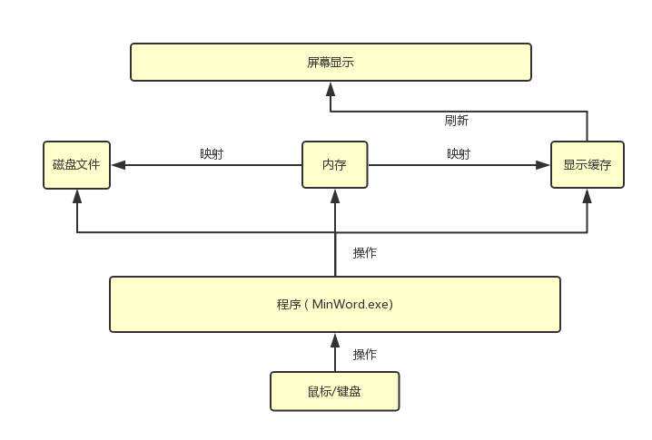
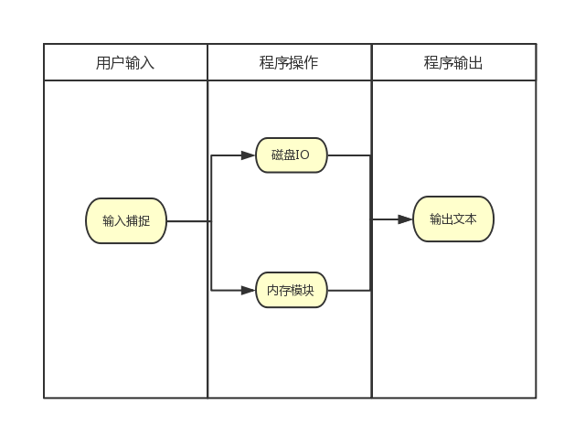

# 总体方案设计说明

## 软件开发环境

* 在本次开发中，我们使用`Qt`开发环境。
* 但是我们对于`Qt`并不是很熟悉，因此在开发的前期使用`Qt Creator`，可以使用官方的帮助文档，可以更快的熟悉`Qt`的使用。在开发的后期，因为已经足够熟，因此我们在`Windows`下使用`Visual Studio`平台进行开发以方便debug。

## 总体结构

* 程序的总体结构为：

  * 用户通过鼠标和键盘输入信息。
  * 程序捕获用户输入之后对应到相应的操作当中，然后去调用相关类的方法，例如：
    * 磁盘IO
    * 插入删除操作等。
  * 进行相应的操作之后，若内存内部内容改变，则刷新屏幕的缓存。
  * 使用一个`QTtimer`定时器定时刷新屏幕。

> 程序总体结构示意图如下：

## 模块划分

* 通过程序的总体结构，我们可以很容易的将整个软件划分为如下几个模块：

  * 用户输入捕捉模块：这个模块捕捉用户输入，并且将用户输入转化为相应指令进行操作。
  * 磁盘IO模块：和外部储存之间进行信息交换，进行文件储存和读取。
  * 内存模块：储存文本信息，并且在规定的数据结构上对文本进行相应的操作。
  * 显示模块：使用缓存缓冲需要显示的内容，并且在规定的时间进行刷新显示。

> 模块划分示意图如下：

