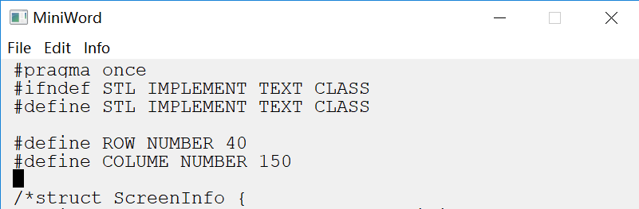
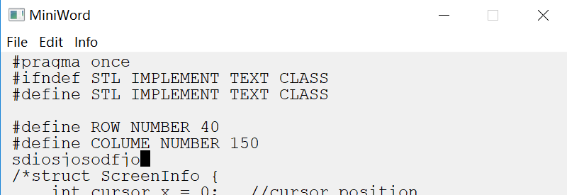
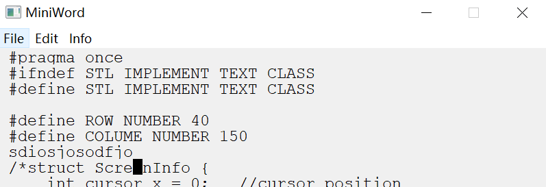
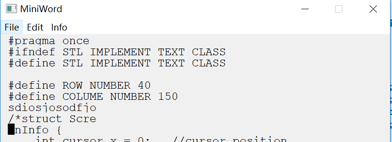
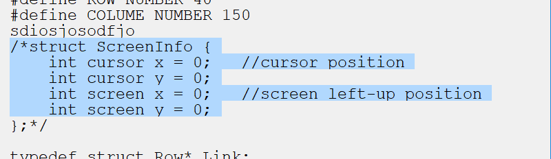
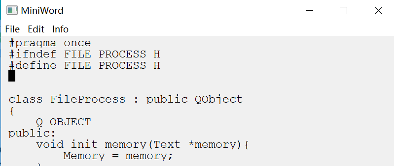

# 测试报告

* 测试人员：杨依霖、刘思聪、温和
* 测试时间：5 月 28 日
* 运行环境：macOS High Sierra、Windows 10

------

### 光标移动

* 正常操作

### 删除操作

* 正常操作

### 查找、替换字符/串

* 正常操作

### 即时插入操作：

* 非空字符串：

> 插入字符串之前

> 插入字符串之后

* 空串：

> 插入字符串之前

> 插入字符串之后
> 

* 正常操作

### 块选中：

* 正常操作

### 打开文件：

* 正常操作