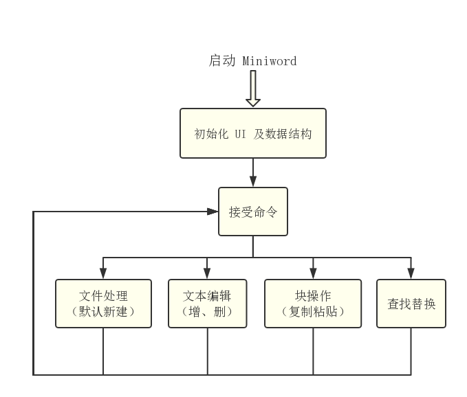
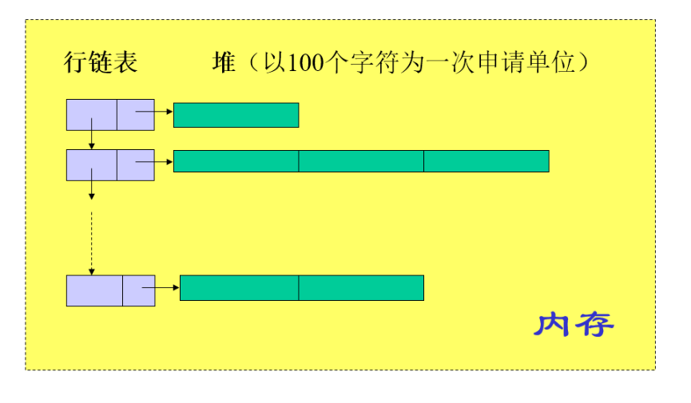

# 需求分析

## 基本要求

* 可以将基本要求中的两个操作状态合并为一个操作状态。

  * 在常规模式就是编辑模式，可以对文档进行编辑操作。
  * 然后通过菜单栏，可以进入文件状态，对文件进行打开和保存等操作。

## 功能需求

* 新文件处理功能中的要求都是最基本的文件打开保存功能，无需进行进一步分析。只需要简单的实现四个功能就好。

* 文本窗口编辑功能

  * 我们考虑模仿`vim`在编辑模式下的光标样式与行为，将字符加黑表示当前操作在次字符之前。因此视觉上的效果是在光标之前插入内容，然后光标移动到插入字符之后。
  * 当输入回车时，插入一个换行符。从当前光标以后的内容放入创建的新行。
  * 按下`Backspace`，若光标在行首，则当前行删除，内容接到上一行的结尾，光标跟着删除行的第一个字符移动到上一行。若不在行首，则向前删除一个字符，光标向前移动一个位置。
  * 按下`Delete`，若光标在行尾，则下一行删除，内容接到本行的结尾。若不在行尾，则向后删除一个字符。
  * 查找替换字符/串，当查找到字符串之后，将光标定位到查找的字符/串首，然后将所选字符串高亮显示。
  * 可以进入快选中模式（或使用快捷键加光标移动键）然后进行光标选中。当选中完成之后，可以对块进行操作，例如复制，粘贴，删除等操作。

* 鼠标或其他热键编辑功能

  * 我们的逻辑是建立在`vim`上设计并进行优化的。因此并没有打算支持鼠标的光标选中操作。但是可以利用光标对菜单进行操作。
  * `Home` `End` `PageUp` `PageDown`本质就是光标的移动，只需要将相应的操作当成成组的光标移动就可以完成。

## 程序结构

* 我们设计的程序结构和程序参考结构类似。

> 程序结构设计如图

## 内存存储要求

* 规定程序必须符合要求的数据结构要求，以防抄袭，因此我们只能使用行使用链表，列使用块链。

* 其中每一个块为当程序需要时在堆中申请。

> 内存储存见图

## 基本数据结构要求

* 外存以及显示器中所有内容均为从内存数据结构中映射而来。

* 考虑到显示的显示刷新原理，以及规定内存结构的性能，我们决定增加一个缓存区。

  * 从内存中映射文本内容到显示缓存区，然后由一个定时器定时从缓存区将文本添加上光标刷新在屏幕上。
  * 内存中仅仅保存光标的绝对位置，相对位置由内存数据结构到缓存区映射时处理。
  * 这样在刷新时无需访问数据结构，刷新显示的性能可以的到保障。